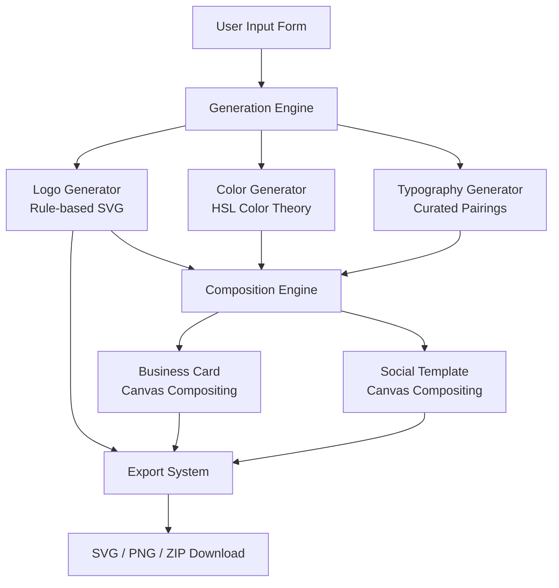
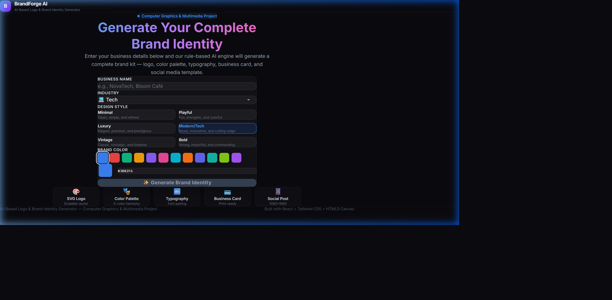
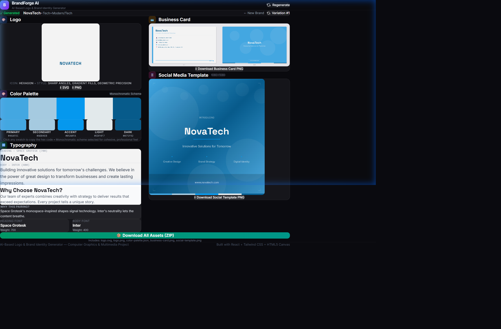
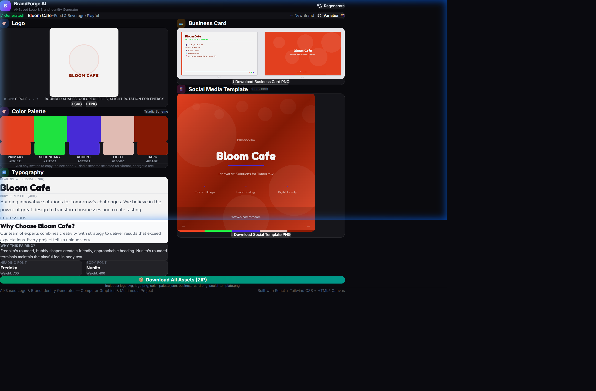
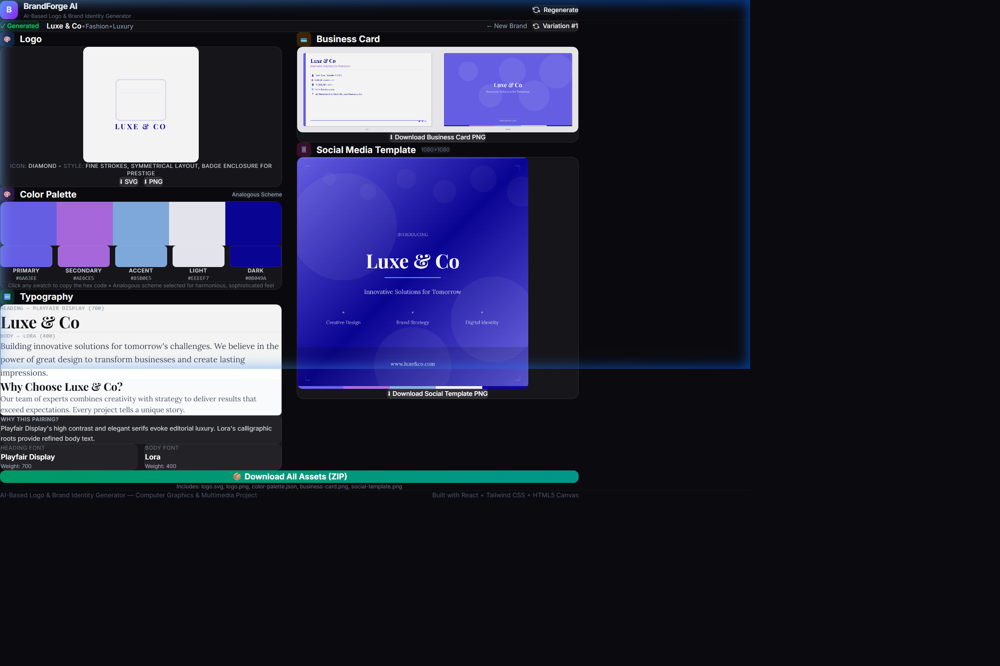

# 🎨 BrandForge AI — AI-Based Logo & Brand Identity Generator

> **Computer Graphics & Multimedia Project** — A rule-based brand identity generation system that creates complete visual identity kits from minimal user inputs.


---

## 📋 Problem Statement

Startups and small businesses often struggle to create a professional visual identity due to the high cost of hiring designers and the complexity of brand design tools. This project addresses this gap by providing an **intelligent, algorithmic brand identity generator** that produces publication-ready assets from just four simple inputs.

## 🎯 Objective

Build a web application that:
1. Accepts minimal user inputs (business name, industry, style preference, base color)
2. Algorithmically generates a complete brand identity kit using rule-based AI
3. Produces exportable, production-ready assets (SVG, PNG, ZIP)
4. Demonstrates core Computer Graphics concepts (SVG generation, Canvas compositing, color theory, typography)

---

## ✨ Features

| Feature | Description |
|---------|-------------|
| **SVG Logo Generation** | Rule-based logo composed from geometric shapes mapped to industry × style matrix |
| **Color Palette** | 5-color palette generated using HSL color theory (monochromatic, triadic, analogous, split-complementary) |
| **Typography Pairing** | Curated Google Fonts pairings with live preview and pairing rationale |
| **Business Card Mockup** | Front + back card rendered on HTML5 Canvas with brand identity applied |
| **Social Media Template** | Instagram-sized (1080×1080) post template with branded design |
| **Export System** | Individual PNG/SVG downloads + bundled ZIP export via JSZip |
| **Regenerate Variations** | Cycle through alternate designs for the same inputs |
| **Responsive UI** | Dark-themed, glassmorphism UI that works on desktop and tablet |

---

## 🏗️ Architecture Overview



### Data Flow

```
User Inputs (name, industry, style, color)
       │
       ├─→ colorGenerator.js ──→ 5-color palette (HSL algorithms)
       ├─→ typographyGenerator.js ──→ Font pairing (curated lookup)
       └─→ logoGenerator.js ──→ SVG markup (shape composition)
              │
              ▼
       businessCardRenderer.js ──→ Canvas (1050×600 × 2 sides)
       socialTemplateRenderer.js ──→ Canvas (1080×1080)
              │
              ▼
       exportUtils.js ──→ ZIP bundle (JSZip + FileSaver.js)
```

---

## 🧠 Algorithm Explanations

### 1. Color Palette Generation (HSL Color Theory)

The color generator converts the user's base color to **HSL (Hue, Saturation, Lightness)** space and applies geometric transformations on the color wheel:

| Brand Style | Color Scheme | Algorithm |
|-------------|-------------|-----------|
| Minimal | Monochromatic | Same hue, vary S and L: `S ± 20, L ± 30` |
| Playful | Triadic | Three hues equally spaced: `H, H+120°, H+240°` |
| Luxury | Analogous | Adjacent hues: `H, H+30°, H-30°` with desaturation |
| Modern/Tech | Monochromatic | Same hue with high contrast: `L range: 10–95` |
| Vintage | Analogous (Muted) | Adjacent hues with `S reduced by 25–30%` |
| Bold | Split-Complementary | Base + flanking complement: `H, H+150°, H+210°` |

**Key formulas:**
- Hue rotation: `H' = (H + offset) mod 360`
- Saturation adjustment: `S' = clamp(S + delta, 0, 100)`
- Lightness adjustment: `L' = clamp(L + delta, 0, 100)`
- HSL → RGB conversion uses the standard CSS Color Module Level 4 algorithm

### 2. Typography Pairing Logic

Fonts are selected from a curated database of **Google Fonts** pairings, organized by brand style. Each pairing follows typography design principles:

- **Contrast**: Heading and body fonts have distinct visual character
- **Harmony**: Fonts share similar proportions or design era
- **Hierarchy**: Heading fonts are more expressive; body fonts prioritize readability

Each style has 3 alternate pairings to support the "Regenerate" feature.

### 3. Logo Composition Logic

Logos are generated using a **2D lookup matrix**: `Industry × Style → Visual Parameters`

**Three-layer composition:**
1. **Enclosure Layer**: Optional background shape (circle, badge, square) based on style
2. **Icon Layer**: Geometric primitive(s) representing the industry (e.g., hexagon for Tech, leaf for Food)
3. **Text Layer**: Business name rendered in the heading font

**Shape treatments by style:**
- Minimal → thin strokes, no fill
- Playful → rounded, filled, slight rotation
- Luxury → fine strokes, badge enclosure
- Modern/Tech → gradient fills, sharp angles
- Vintage → badge enclosure, warm feel
- Bold → thick strokes, heavy fills

All SVG elements are created programmatically using `document.createElementNS()`.

### 4. Canvas Compositing (Business Card & Social Template)

Both mockups use the **HTML5 Canvas 2D API** for pixel-based rendering:

- `fillRect()` — backgrounds and color blocks
- `fillText()` — text rendering with loaded Google Fonts
- `drawImage()` — logo placement
- `createLinearGradient()` — gradient backgrounds
- `arc()` — decorative circles
- `globalAlpha` — transparency/layering effects
- Custom `drawRoundedRect()` — rounded corners via quadratic Bézier curves

---

## 🛠️ Tech Stack

| Technology | Purpose |
|-----------|---------|
| **React 18** | Component-based UI framework |
| **Vite** | Fast build tool with HMR (Hot Module Replacement) |
| **Tailwind CSS v4** | Utility-first CSS framework for rapid styling |
| **HTML5 Canvas** | Rasterized 2D graphics rendering (business card, social template) |
| **SVG** | Vector graphics for scalable logo generation |
| **JSZip** | Client-side ZIP file generation |
| **FileSaver.js** | Cross-browser file download triggering |
| **Google Fonts API** | Dynamic font loading for typography pairings |

### Why This Stack?

- **React + Vite**: Industry-standard for modern SPAs with excellent DX
- **Tailwind CSS**: Rapid prototyping without writing custom CSS for layout
- **Canvas + SVG**: Directly demonstrates Computer Graphics concepts (the course requirement)
- **No Backend**: Entirely client-side — no API keys, no server costs, instant generation

---

## 📁 Project Structure

```
CGMM/
├── index.html                  # Entry point with SEO meta tags
├── vite.config.js              # Vite + Tailwind CSS v4 configuration
├── package.json                # Dependencies and scripts
├── .gitignore                  # Git ignore rules
│
├── src/
│   ├── main.jsx                # React entry point
│   ├── App.jsx                 # Root component (state management + layout)
│   ├── index.css               # Tailwind import + custom theme
│   │
│   ├── components/
│   │   ├── InputForm.jsx       # User input form (name, industry, style, color)
│   │   ├── LogoPreview.jsx     # SVG logo display + export buttons
│   │   ├── ColorPalette.jsx    # 5-color palette display with hex codes
│   │   ├── TypographyPreview.jsx  # Font pairing preview
│   │   ├── BusinessCard.jsx    # Canvas-rendered business card mockup
│   │   ├── SocialMediaTemplate.jsx  # Canvas-rendered social media post
│   │   └── ExportAll.jsx       # ZIP export button
│   │
│   └── lib/
│       ├── colorUtils.js       # HSL ↔ Hex conversion, luminance, contrast
│       ├── canvasUtils.js      # SVG→Canvas, font loading, text wrapping
│       ├── exportUtils.js      # PNG/SVG/ZIP download functions
│       │
│       └── generators/
│           ├── colorGenerator.js        # HSL color theory palette engine
│           ├── typographyGenerator.js   # Curated font pairing selection
│           ├── logoGenerator.js         # Rule-based SVG logo composition
│           ├── businessCardRenderer.js  # Canvas business card rendering
│           └── socialTemplateRenderer.js  # Canvas social post rendering
│
├── docs/
│   └── PROJECT_REPORT.md       # Formal academic project report
│
└── README.md                   # This file
```

---

## 🚀 Setup & Installation

### Prerequisites
- **Node.js** ≥ 18.x
- **npm** ≥ 9.x

### Install & Run

```bash
# 1. Clone the repository
git clone https://github.com/YOUR_USERNAME/CGMM.git
cd CGMM

# 2. Install dependencies
npm install

# 3. Start development server
npm run dev

# 4. Open in browser
# Navigate to http://localhost:5173
```

### Build for Production

```bash
npm run build    # Creates optimized bundle in /dist
npm run preview  # Preview the production build
```

---

## 📸 Screenshots

### 1. Landing Page & Interactive Input Studio


### 2. Generated Brand Kit — NovaTech (Tech / Modern/Tech)


### 3. Generated Brand Kit — Bloom Café (Food & Beverage / Playful)


### 4. Generated Brand Kit — Luxe & Co (Fashion / Luxury)


---

## 🔮 Future Scope

1. **Generative AI Integration**: Replace rule-based logo generation with DALL-E or Stable Diffusion for more creative, unique logos
2. **User Feedback Loop**: Allow users to rate generated designs and use feedback to improve the recommendation engine
3. **More Templates**: Add letterhead, envelope, social media story (9:16), and presentation slide templates
4. **Custom Icon Upload**: Let users upload their own icon/symbol to incorporate into the brand identity
5. **Brand Guidelines PDF**: Auto-generate a comprehensive brand guidelines document
6. **Animation Support**: Add animated logo variations (CSS/SVG animations) for digital use
7. **Color Accessibility**: Add WCAG contrast ratio checker to ensure color palette meets accessibility standards
8. **Multi-language Support**: Support for non-Latin scripts in logo and typography generation
9. **Collaborative Editing**: Real-time collaboration features for team design sessions
10. **Template Marketplace**: Community-contributed templates and style presets

---

## 📄 Documentation

- **[Project Report](./docs/PROJECT_REPORT.md)** — Full formal academic report suitable for submission
- **Code Comments** — All source files include detailed JSDoc comments explaining the algorithms

---

## 👨‍💻 Author

Computer Graphics & Multimedia Course Assignment

---

## 📜 License

This project is created for educational purposes as part of a Computer Graphics & Multimedia course assignment.
